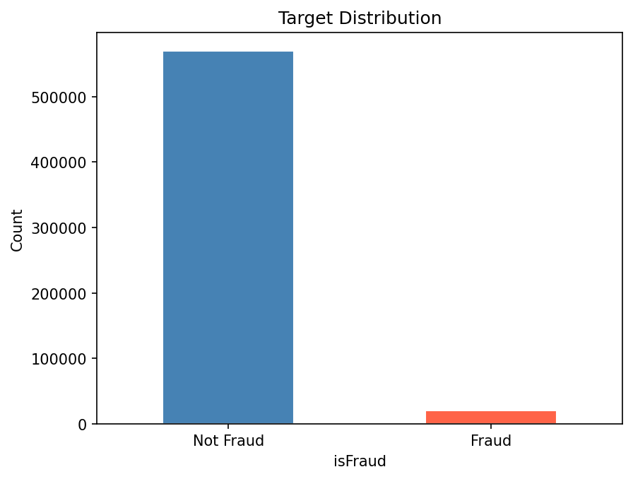
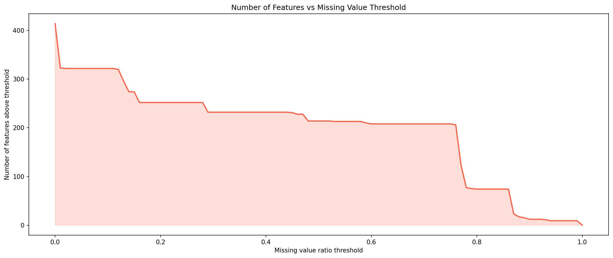
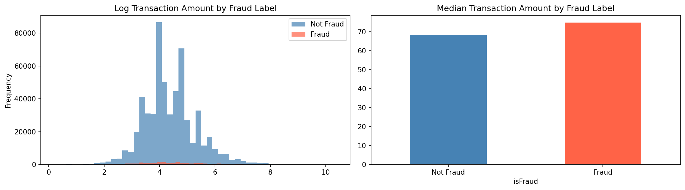
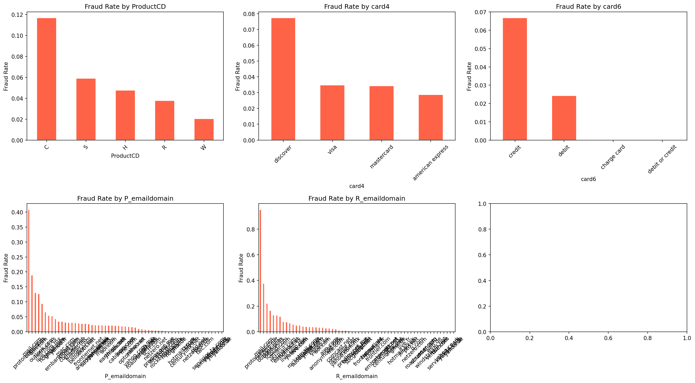
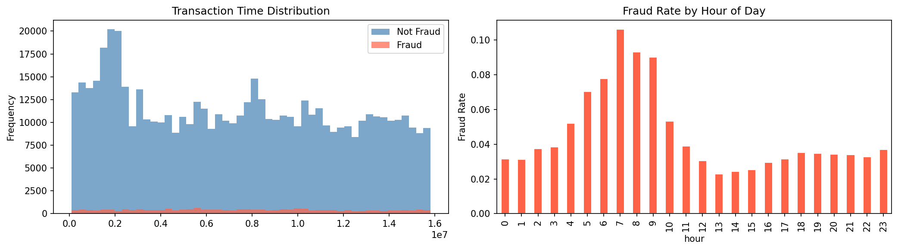
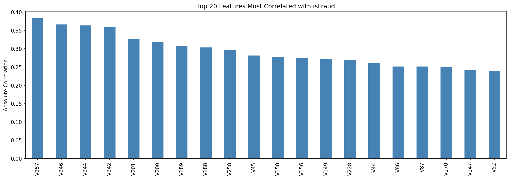

# IEEE-CIS-Fraud-Detection

## პროექტის მოკლე აღწერა
ეს პროექტი არის supervised learning-ის ერთ-ერთი მაგალითი, რომელშიც ჩვენი მიზანია დავადგინოთ ტრანზაქცია ყალბია თუ არა.
პრობლემა წარმოადგენს კლასიფიკაციის ამოცანას.

### შეფასების მეტრიკა
მოდელი ფასდება AUROC (Area Under ROC Curve) მეტრიკით.

დამატებით ვაკვირდებით **Recall, Precision და F1** მეტრიკებს:

- **Recall** არის ყველაზე მნიშვნელოვანი მეტრიკა ამ პრობლემაში -
  გვიჩვენებს fraud-ების რამდენ პროცენტს ვპოულობთ. Fraud-ის
  გამოტოვება (False Negative) კატასტროფულია - ადამიანი კარგავს
  ფულს.

- **Precision** გვიჩვენებს როცა fraud-ს ვამბობთ, რამდენჯერ ვართ
  მართალი. დაბალი Precision = ბევრი უდანაშაულო ტრანზაქცია
  იბლოკება (False Positive) - უსიამოვნოა მაგრამ არა კატასტროფა.

- **AUROC** კლასების პროპორციისგან დამოუკიდებლად აფასებს მოდელის
  უნარს გაარჩიოს fraud და non-fraud - სწორედ ამიტომ არის
  არჩეული imbalanced dataset-ზე.

## ჩემი მიდგომა
პრობლემის გადასაჭრელად გამოვიყენე შემდეგი workflow:
1. **EDA** - მონაცემების შესწავლა და პრობლემების იდენტიფიცირება
2. **Data Cleaning** - missing values დამუშავება
3. **Feature Engineering** - ახალი ინფორმაციული ცვლადების შექმნა
4. **Encoding and Imputation** - ცვლადების encoding და imputing
5. **Feature Selection** - უსარგებლო ცვლადების ამოღება და სწორი ცვლადების შერჩევა მოდელის დასატრენინგებლად
5. **Model Training** - baseline მოდელებიდან advanced მოდელებამდე + HPO (Hyperparameter Optimization)

## რეპოზიტორიის სტრუქტურა
```
IEEE-CIS-Fraud-Detection/
├── images/                                      # გრაფიკები README-თვის
├── model_experiment_{model_architecture}.ipynb  # თითოეული მოდელის არქიტექტურისთვის მთავარი სამუშაო ფაილი მოდელის დასატრენინგებლად
├── model_inference.ipynb                        # საბოლოო პროგნოზი და submission
├── eda.ipynb                                    # Exploratory Data Analysis
└── README.md                                    # პროექტის დოკუმენტაცია
```

## Exploratory Data Analysis (EDA)

### მონაცემების სტრუქტურა
- train_df-ს აქვს 590540 სტრიქონი და 434 სვეტი.
- 403 numerical სვეტი, 31 categorical სვეტი.

### Target (isFraud) განაწილება

მონაცემები არაბალანსირებულია - მხოლოდ **3.5%** ტრანზაქციაა fraudulent.
ეს ნიშნავს, რომ Accuracy უსარგებლო მეტრიკაა, რადგან მოდელი რომელიც ყველაფერზე იტყვის რომ not fraud არის, 96.5% შემთხვევებში სწორი იქნება.
სწორედ ამიტომაა მეტრიკად არჩეული AUROC, რომელიც აფასებს მოდელის უნარს გაარჩიოს ორი კლასი ერთმანეთისგან პროპორციის მიუხედავად.

### Missing Values

Missing values-ების ანალიზმა აჩვენა, რომ სვეტების დიდი ნაწილი შეიცავს 
გამოტოვებულ მნიშვნელობებს. გრაფიკი გვიჩვენებს რამდენ ცვლადს აქვს კონკრეტულ 
ზღვარზე მეტი missing values:

- 70%-ზე მეტი missing: **208 ცვლადი**
- 80%-ზე მეტი missing: **74 ცვლადი**
- 90%-ზე მეტი missing: **12 ცვლადი**

70%-დან 80%-მდე გადასვლისას ყველაზე მკვეთრი კლებაა - 208-დან 74-მდე. 
სწორედ ეს არის ბუნებრივი ზღვარი, ამიტომ Cleaning ეტაპზე ამოვიღებ ყველა 
ცვლადს, რომელსაც **80%-ზე მეტი** missing values აქვს.

### Transaction Amount Analysis

ტრანზაქციის თანხის განაწილება 2 კლასს შორის მსგავსია - მედიანებსა და საშუალოებს შორის არაა დიდი განსხვავება.
ეს ნიშნავს, რომ `TransactionAmt` მარტო სუსტი სიგნალია, თუმცა კომბინაციაში შეიძლება გამოგვადგეს.

### Categorical Feature Fraud Rates

დავაკვირდი რამდენიმე კატეგორიულ ცვლადს და მათ შორის target-ის განაწილებებს.

| ცვლადი | დაკვირვება                                                                  |
|---|-----------------------------------------------------------------------------|
| `ProductCD` | C კატეგორიას აქვს ~12% fraud rate - ყველაზე მაღალი                          |
| `card4` | Discover ბარათს აქვს ~8% fraud rate - Visa/Mastercard-ზე გაცილებით მაღალი   |
| `card6` | Credit ბარათები (~6.5%) დაახლოებით 2.5-ჯერ უფრო საეჭვოა ვიდრე Debit (~2.5%) |
| `P_emaildomain` | გარკვეული დომენები აღწევს ~40% fraud rate-ს                                 |
| `R_emaildomain` | გარკვეული დომენები აღწევს ~80-90% fraud rate-ს - ძალიან ძლიერი სიგნალი      |


### Transaction Time Analysis

დღის საათი მნიშვნელოვანი სიგნალია:
- **4-10** საათებში ფიქსირდება ყველაზე მაღალი fraud rate.

სავარაუდოდ, ეს იმითაა გამოწვეული, რომ 4-10 საათებში ხალხს უმეტესად სძინავს და საეჭვო ტრანზაქციებს ვერ ამჩნევენ.

### Correlations

კორელაციების ანალიზი ჩავატარე, თუმცა შენიღბულია მონაცემები, ამიტომ ეს ამ ეტაპზე დიდად ინფორმაციული არაა.

## Data Cleaning

### Missing მონაცემების დამუშავება
EDA-ში ნაჩვენები გრაფიკის საფუძველზე გადავწყვიტე 80%-ზე მეტი missing value-ს მქონე ცვლადი ამომეღო.
ამოვიღე 74 სვეტი და დამრჩა 358.

Numeric ცვლადების Imputation-თვის გამოვიყენებ მედიანას, რადგან უკეთ აღწერს ზოგად ტრენდს (outlier-ების მიმართ მდგრადია).

## Feature Engineering

თითოეულ მოდელში გამოვიყენე შემდეგი feature engineering მიდგომები.
V1-V339 ცვლადები Vesta Corporation-ის მიერ შენიღბულია და მათი
ინტერპრეტაცია შეუძლებელია, ამიტომ ისინი გამოყენებულ იქნა პირდაპირ.

### საერთო features ყველა მოდელში
- **hour, day, month** - TransactionDT-დან დროის ამოღება
- **log_TransactionAmt** - თანხის log transformation skewness-ის გამო
- **cents** - ათობითი ნაწილი, fraudsters მრგვალ თანხებს იყენებს
- **uid, uid2** - card1+card2+card3 კომბინაცია, ბარათის identifier
- **email_match** - გამგზავნი და მიმღები email ემთხვევა თუ არა
- **P_email_count, R_email_count** - email დომენის სიხშირე dataset-ში
- **card1_count, uid_count** - ბარათის გამოჩენის სიხშირე
- **OS, browser** - id_30, id_31 სტრიქონების გაყოფა

### XGBoost-ისთვის დამატებითი features
- **dollars** - თანხის მთელი ნაწილი
- **card1_mean_amt, card1_std_amt** - ბარათის საშუალო და std თანხა
- **uid_mean_amt, uid_std_amt** - uid-ის საშუალო და std თანხა
- **amt_deviation** - ტრანზაქცია რამდენად განსხვავდება ბარათის საშუალოდან
- **amt_deviation_uid** - იგივე uid დონეზე

### კატეგორიული ცვლადების Encoding
- **Linear მოდელები** - Label Encoding binary სვეტებზე, Target Encoding
  მაღალი კარდინალობის სვეტებზე (email domains, DeviceInfo)
- **Tree-based მოდელები** - Label Encoding ყველა categorical სვეტზე,
  scaling არ სჭირდება

### Missing Values
- **80%+ missing** - ამოვიღეთ (74 სვეტი)
- **დარჩენილი NaN** - Median imputation, fit on train only


## Feature Selection

სხვადასხვა მოდელისთვის სხვადასხვა feature selection მიდგომა გამოვიყენე:

| მოდელი | მეთოდი 1 | მეთოდი 2 | საბოლოო features |
|---|---|---|---|
| Logistic Regression | კორელაცია <0.005 | SelectKBest k=100 | 100 |
| Decision Tree | კორელაცია <0.005 | Tree importance >0 | 25 |
| Random Forest | კორელაცია <0.005 | RF importance mean | 52 |
| AdaBoost | კორელაცია <0.005 | SelectKBest k=80 | 80 |
| XGBoost | კორელაცია <0.005 | XGB importance >0 | 168 |

XGBoost-ში დამატებით Permutation Importance გამოვიყენე - ყველაზე
reliable მიდგომა. feature-ის მნიშვნელობა random-ად ვარყევთ და AUC-ის
კლებას ვზომავთ. 168 feature შერჩეული იქნა საბოლოოდ.

## Training

### Logistic Regression
Logistic Regression გამოვიყენე, როგორც მარტივი baseline მოდელი კლასიფიკაციისთვის.
  
**Hyperparameter Optimization:**
C პარამეტრი გავტესტე სამ მნიშვნელობაზე:

| C | AUC | F1 | Precision | Recall |
|---|---|---|---|---|
| 0.1 | 0.7902 | 0.2562 | 0.1660 | 0.5609 |
| 1.0 | 0.7903 | 0.2572 | 0.1669 | 0.5604 |
| 10 | 0.7903 | 0.2561 | 0.1660 | 0.5609 |

C პარამეტრი შედეგზე თითქმის არ მოქმედებს - მოდელი არ არის სენსიტიური რეგულარიზაციის მიმართ ამ dataset-ზე.

**შედეგების ანალიზი:**


- AUC 0.79 - საკმაოდ კარგია linear მოდელისთვის
- F1 0.26 - დაბალია, imbalanced data-ს პრობლემა რჩება
- Precision 0.17 - როცა fraud-ს ამბობს, 17%-ში მართალია
- Recall 0.56 - fraud-ების 56%-ს პოულობს
- CV AUC std 0.0021 - სტაბილური მოდელია

მოდელი არ არის overfit-ში წასული (CV AUC ≈ Test AUC = 0.79), მაგრამ
underperform-ს შვრება F1-ზე - ეს მოსალოდნელია რადგან fraud detection არ არის linear პრობლემა.
tree-based მოდელები გაცილებით უკეთეს შედეგს მოგვცემს.

**საუკეთესო მოდელი:** C=1, შენახულია MLflow Model Registry-ში
სახელით `LogisticRegression_Fraud`.


### Decision Tree

Decision Tree გამოვიყენე როგორც საშუალო კომპლექსურობის მოდელი, რომლითაც კარგად ვაჩვენებ Overfit/Underfit მოდელებს.

**Feature Selection:**

გავტესტე ორი მიდგომა:
- threshold='mean' - მხოლოდ 19 feature დარჩა, რაც მეცოტავა.
- importance > 0 - 25 feature დარჩა, რაც შედარებით უკეთესია.

**Hyperparameter Optimization:**
გავტესტე max_depth = 2, 5, 10, 15, 20, None 

| max_depth | Train AUC | Test AUC | CV AUC | F1 |
|---|---|---|---|---|
| None (overfit) | 0.9977 | 0.6683 | - | - |
| 2 (underfit) | 0.7158 | 0.7188 | - | - |
| 5 | 0.8085 | 0.8070 | 0.8076 | 0.21 |
| 10 | 0.8623 | 0.8319 | 0.8390 | 0.25 |
| 15 | 0.9122 | 0.7760 | 0.8159 | 0.27 |
| 20 | 0.9584 | 0.6949 | 0.7618 | 0.29 |

**შედეგების ანალიზი:**

`max_depth=None` - სტანდარტული overfit. Train AUC 0.9977, მაგრამ
Test AUC მხოლოდ 0.6683. მოდელი სატრენინგო მონაცემებს იზეპირებს 
და ახალ მონაცემებზე ვერ აზოგადებს. max_depth=53 გამოვიდა, რაც ზედმეტად ღრმა ხეა.

`max_depth=2` - სტანდარტული underfit. ორივე Train და Test AUC დაბალია (0.71).
მოდელის არქიტექტურა ზედმეტად მარტივია და ვერ სწავლობს ამოცანაში არსებულ პატერნებს.

`max_depth=10` - საუკეთესო ბალანსი. Train და Test AUC შედარებით
ახლოს არის (0.8623 vs 0.8319), CV AUC 0.8390 stable-ია.

`max_depth=15, 20` - overfit იწყება. Train AUC იზრდება მაგრამ
Test AUC კლებულობს - მოდელი სატრენინგო მონაცემების noise-ს სწავლობს.

**საუკეთესო მოდელი:** max_depth=10, Test AUC 0.8319 - შენახულია
MLflow Model Registry-ში სახელით `DecisionTree_Fraud`.


### Random Forest

Random Forest არის Decision Tree Ensemble - ბევრი tree ერთად უკეთეს შედეგს გვაძლევს ვიდრე ერთი.


**Hyperparameter Optimization:**

n_estimators და max_depth კომბინაციები გავტესტე:

| n_estimators | max_depth | Train AUC | Test AUC | CV AUC | F1 |
|---|---|---|---|---|---|
| 10 (underfit) | 3 | 0.8122 | 0.8120 | - | - |
| 500 (overfit) | None | 0.9750 | 0.8512 | - | - |
| 25 | 5 | 0.8357 | 0.8345 | 0.8332 | 0.23 |
| 25 | 10 | 0.8659 | 0.8599 | 0.8596 | 0.25 |
| 25 | 15 | 0.8967 | 0.8747 | 0.8704 | 0.31 |
| 50 | 15 | 0.8975 | 0.8757 | 0.8714 | 0.30 |
| 100 | 15 | 0.8986 | 0.8765 | 0.8728 | 0.31 |
| 150 | 15 | 0.8991 | 0.8769 | 0.8731 | 0.31 |
| 250 | 15 | 0.8990 | 0.8767 | 0.8732 | 0.31 |

**შედეგების ანალიზი:**

**Underfit** - n=10, depth=3: Train და Test AUC ორივე დაბალია. მოდელი ძალიან მარტივია - 10 shallow tree
საკმარისი სიგნალი არ არის.

**Overfit** - n=500, depth=None: Train AUC 0.975 vs Test AUC
0.851 - ძალიან დიდი სხვაობაა. Decision Tree-გან განსხვავებით Random Forest უფრო რთულად
მიდის overfit-ში, მაგრამ თუ მივუშვით (როგორც ამ შემთხვევაში), მაინც წავა.

**საინტერესო დაკვირვება** - n_estimators 25-დან 250-მდე
პრაქტიკულად არ ცვლის შედეგს. ეს ნიშნავს რომ 25 tree
საკმარისია ამ dataset-ზე და დამატებითი tree-ები redundant-ია.

**max_depth გავლენა** - depth=15 consistently საუკეთესოა.
depth=5 არ აქვს საკმარისად კარგი პერფორმანსი, depth=15 კარგი ბალანსია overfit-ის გარეშე.

**საუკეთესო მოდელი** - n=150, depth=15:
- Test AUC: 0.8769
- CV AUC: 0.8731
- Logistic Regression-ზე (0.79) და Decision Tree-ზე (0.83)
  გაცილებით უკეთესი

შენახულია MLflow Model Registry-ში სახელით `RandomForest_Fraud`.

### AdaBoost

AdaBoost არის boosting-ის ერთ-ერთი მეთოდი - თითოეული weak learner ფოკუსირდება
წინას შეცდომებზე. Decision Tree-გან განსხვავებით ensemble მიმდევრობით კეთდება.

**Hyperparameter Optimization:**

n_estimators და learning_rate კომბინაციები გავტესტე:

| n_estimators | learning_rate | Train AUC | Test AUC | CV AUC | F1 |
|---|---|---|---|---|---|
| 10 (underfit) | 0.1 | 0.6405 | 0.6418 | - | - |
| 500 (overfit) | 1.0 | 0.7410 | 0.7474 | - | - |
| 50 | 0.01 | 0.6447 | 0.6455 | 0.6447 | 0.00 |
| 50 | 0.1 | 0.7197 | 0.7262 | 0.7222 | 0.13 |
| 50 | 0.5 | 0.7175 | 0.7230 | 0.7156 | 0.27 |
| 100 | 0.01 | 0.6446 | 0.6454 | 0.6446 | 0.00 |
| 100 | 0.1 | 0.7237 | 0.7299 | 0.7238 | 0.14 |
| 100 | 0.5 | 0.7201 | 0.7262 | 0.7221 | 0.27 |
| 200 | 0.01 | 0.7131 | 0.7174 | 0.7134 | 0.00 |
| 200 | 0.1 | 0.7241 | 0.7303 | 0.7254 | 0.16 |
| 200 | 0.5 | 0.7267 | 0.7325 | 0.7245 | 0.27 |

**შედეგების ანალიზი:**

**Underfit** - n=10, lr=0.1: Train 0.6405 | Test 0.6418 - ორივე
დაბალია და თითქმის იდენტური. 10 weak learner საკმარისი არ არის დატაში არსებული პატერნების სასწავლად.

**Overfit** - n=500, lr=1.0: Train 0.7410 | Test 0.7474 -
აქ overfit ვცადე, თუმცა test train-ზე მაღალი გამოვიდა.
ამის ერთ-ერთი მიზეზი ისაა, რომ ensemble მეთოდები უფრო ძნელად გადიან overfit-ში.

**learning_rate=0.01** - ყველა შემთხვევაში **F1=0** - მოდელი ყველა
ტრანზაქციას not fraud-ად პროგნოზირებს. learning_rate იმდენად
დაბალია რომ მოდელი საერთოდ ვერ სწავლობს fraud კლასს. AUC მაინც 0.64-0.71-ია
რადგან AUC probability scores-ს იყენებს და არა hard predictions-ს.

**learning_rate გავლენა** - lr=0.5 consistently უკეთესია lr=0.1-ზე.
მაღალი learning rate უფრო სწრაფად სწავლობს fraud პატერნს.

**n_estimators გავლენა** - 50-დან 200-მდე გაზრდა მინიმალურ
გაუმჯობესებას იძლევა - diminishing returns.

**საერთო დასკვნა** - AdaBoost ამ dataset-ზე სუსტია. მაქსიმუმ
0.73 AUC - Logistic Regression-ზე (0.79) და Random Forest-ზე
(0.877) გაცილებით ნაკლები. მიზეზი: AdaBoost shallow weak
learners-ს იყენებს და ამ რთულ fraud dataset-ზე ვერ სწავლობს
საკმარის პატერნებს.

**საუკეთესო მოდელი** - n=200, lr=0.5, Test AUC 0.7325.
შენახულია MLflow Model Registry-ში სახელით `AdaBoost_Fraud`

### XGBoost

XGBoost არის boosting-ის ერთ-ერთი ყველაზე გავრცელებული და მძლავრი მეთოდი, რომელსაც ჩაშენებული აქვს regularization და ძირითადად ეს გამოიყენება.
ამიტომ მეც ვიცოდი, რომ სავარაუდოდ საუკეთესო შედეგს ეს მოდელი მომცემდა და ყველაზე მეტი დრო მის ტრენინგს დავუთმე.

**Cleaning**

სხვა მოდელებისგან განსხვავებით XGBoost-ში ორი სხვადასხვა cleaning სტრატეგია
გავტესტე:

- **v1: threshold=0.8** - 74 სვეტი ამოვიღეთ, დარჩა 358 სვეტი
- **v2: threshold=0.7** - 208 სვეტი ამოვიღეთ, დარჩა 224 სვეტი

v2 baseline-ზე უკეთეს შედეგს იძლევა (0.9319 vs 0.9255), რაც ნიშნავს რომ 70-80%
missing მქონე სვეტები ძირითადად noise იყო და არა სიგნალი. თუმცა Optuna-ს ჰიპერპარამეტრების ოპტიმიზაციის შემდეგ
v1 საუკეთესო აღმოჩნდა (0.9626 vs 0.9621) ამიტომ v1 გამოვიყენე საბოლოოდ.


**Training**

**Baseline** - default params:
- Train AUC: 0.9748 | Test AUC: 0.9255 | F1: 0.4333
- კარგი baseline მაგრამ train/test gap ნიშნავს, რომ რეგულარიზაცია სჭირდება

**Underfit** - max_depth=2, n_estimators=50, learning_rate=0.01:
- Train AUC: 0.8246 | Test AUC: 0.8258 | F1: 0.2146
- ძალიან მარტივი მოდელი - ვერ სწავლობს საკმარის პატერნებს

**Overfit** - max_depth=15, n_estimators=1000, reg_alpha=0, reg_lambda=0:
- Train AUC: 1.0000 | Test AUC: 0.9590 | F1: 0.7234
- Train AUC სრულყოფილია - მოდელი სატრენინგო მონაცემებს იზეპირებს.
  რეგულარიზაციის გარეშე (reg_alpha=0, reg_lambda=0) XGBoost სწრაფად მიდის overfit-ში.
  თუმცა Test AUC 0.959 აჩვენებს რომ Optuna-თი მაინც შეგვიძლია კარგი შედეგის მიღება.

---

**Hyperparameter Optimization - Optuna:**

სხვა მოდელებისგან განსხვავებით XGBoost-ში Optuna გამოვიყენე -
Bayesian optimization framework რომელიც ჭკვიანურად ეძებს საუკეთესო
ჰიპერპარამეტრებს. Manual grid search-ისგან განსხვავებით Optuna წინა
trial-ების შედეგებზე დაყრდნობით ირჩევს შემდეგ კომბინაციას.

გავტესტე შემდეგი hyperparameters:
- max_depth:        3-10
- learning_rate:    0.01-0.3
- n_estimators:     100-800
- subsample:        0.6-1.0
- colsample_bytree: 0.6-1.0
- min_child_weight: 1-10
- reg_alpha:        0-5
- reg_lambda:       0-5

**v1 Optuna (50 trials, threshold=0.8):**
- Best CV AUC: 0.9646
- Best params: max_depth=10, lr=0.062, n_estimators=800, min_child_weight=6,
  reg_alpha=3.57, reg_lambda=0.004

**v2 Optuna (30 trials, threshold=0.7):**
- Best CV AUC: 0.9621
- Best params: max_depth=10, lr=0.114, n_estimators=557, min_child_weight=3

v1 საუკეთესო აღმოჩნდა - reg_alpha=3.57 ძლიერი L1 რეგულარიზაცია უზრუნველყოფს
კარგ განზოგადებას. 3-fold cross validation გამოვიყენე სანდო შეფასებისთვის.

---

**Cleaning threshold შედარება baseline-ზე:**

| version | threshold | features | baseline AUC | optuna CV AUC | optuna test AUC |
|---|---|---|---|---|---|
| v1 | 0.8 | 358 | 0.9255 | 0.9646 | 0.9626 |
| v2 | 0.7 | 224 | 0.9319 | 0.9621 | 0.9621 |

საინტერესო დაკვირვება - v2 baseline-ზე უკეთესია მაგრამ Optuna-ს შემდეგ v1
უკეთეს CV AUC-ს იძლევა. ეს ნიშნავს რომ 70-80% missing სვეტები noise-ს შეიცავს
მაგრამ Optuna ამ noise-ს უმკლავდება.

---

**საბოლოო Pipeline:**

Pipeline-ი შეიცავს ყველა preprocessing ნაბიჯს raw data-დან prediction-მდე:

Pipeline raw test data-ზე პირდაპირ მუშაობს - preprocessing ხელით არ სჭირდება.

**Pipeline შედეგები:**
- Test AUC: 0.9724
- F1: 0.8035
- Precision: 0.8680
- Recall: 0.7479

Pipeline-ი უკეთეს შედეგს იძლევა ვიდრე ცალკე trained მოდელი (0.9626 AUC)
რადგან სრულ train data-ზე ვატრენინგებთ split-ის გარეშე.

Pipeline შენახულია MLflow Model Registry-ში სახელით `XGBoost_Fraud_Pipeline`,
version 1. inference notebook-ში პირდაპირ იქიდან ვტვირთავ და raw test data-ზე predict-ს ვუშვებ.

**Kaggle Submission Score: 0.930841 (Private), 0.890065 (Public)**


## MLflow Tracking

### MLflow ექსპერიმენტების ბმული
[DagsHub MLflow](https://dagshub.com/lkhiz23/IEEE-CIS-Fraud-Detection.mlflow)

### სტრუქტურა
თითოეული მოდელისთვის ცალკე ექსპერიმენტი შევქმენი:
- `LogisticRegression_Training` - Cleaning, FE, Encoding, Feature Selection, CV runs
- `DecisionTree_Training` - იგივე სტრუქტურა
- `RandomForest_Training` - იგივე სტრუქტურა
- `AdaBoost_Training` - იგივე სტრუქტურა
- `XGBoost_Training` - იგივე სტრუქტურა + Optuna run

### ჩაწერილი მეტრიკები
ყველა run-ზე ჩავწერე: `test_auc`, `test_f1`, `test_precision`, `test_recall`,
`train_auc`, `cv_auc_mean`, `cv_auc_std`

### Model Registry
| მოდელი | Registry სახელი | AUC |
|---|---|---|
| Logistic Regression | LogisticRegression_Fraud | 0.7903 |
| Decision Tree | DecisionTree_Fraud | 0.8319 |
| Random Forest | RandomForest_Fraud | 0.8769 |
| AdaBoost | AdaBoost_Fraud | 0.7325 |
| XGBoost | XGBoost_Fraud_Pipeline | 0.9724 |

## გამოცდილება

მარტივი მოდელებიდან რთულებამდე გადასვლისას AUC 0.79-დან 0.97-მდე გაიზარდა.
ყველაზე დიდი გაუმჯობესება Random Forest-დან XGBoost-ზე გადასვლისას მოხდა, რადგან boosting ამ ტიპის პრობლემას უკეთესად ერგება.

Feature Engineering-მა განსაკუთრებით დიდი როლი ითამაშა - aggregation features
(card1_mean_amt, amt_deviation) და frequency encoding (card1_count, uid_count)
ყველაზე ინფორმაციული features აღმოჩნდა.

---

### სამუშაო გარემო

პროექტი Kaggle-ზე დავწერე, რადგან მონაცემები ძალიან დიდია
(590k+ სტრიქონი, 434 სვეტი) და ლოკალურად გარემოში მეხსიერების პრობლემები მექნებოდა.

თუმცა Kaggle-ზე მუშაობას თავისი შეზღუდვები ჰქონდა:
- **Kernel restarts** - გრძელი გამოთვლებისას (Optuna 50 trial ≈ 3 საათი)
  kernel ხშირად რესტარტებოდა და ყველაფერი მეკარგებოდა.

- **Notebook isolation** - Kaggle-ზე notebook-ები ერთმანეთს ვერ ხედავს,
  ამიტომ preprocessing კოდი (cleaning, feature engineering, encoding)
  ყველა notebook-ში დუბლირებულია. ლოკალურ გარემოში ან GitHub Codespaces-ში
  ეს კოდი ერთ `utils.py` ფაილში იქნებოდა და ყველა notebook-ი მას import-ს
  გაუკეთებდა - კოდი გაცილებით სუფთა და maintainable იქნებოდა
- **Session limits** - Kaggle-ს აქვს session timeout, რაც გრძელი
  ტრენინგისას (XGBoost Optuna) პრობლემებს მიქმნიდა.

ამ შეზღუდვების მიუხედავად Kaggle-მა უზრუნველყო საჭირო რესურსები,
რომელიც ადგილობრივ მანქანაზე შეუძლებელი იქნებოდა.